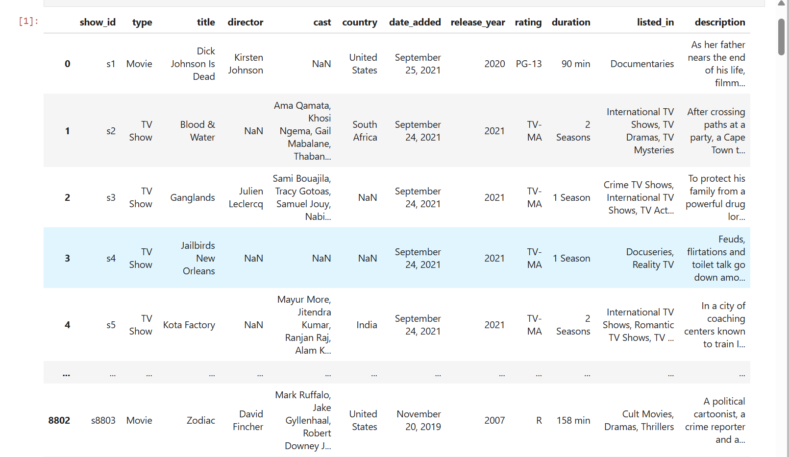
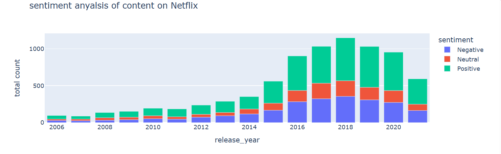

# 📊 Netflix Analysis with Python

This project is a data analysis of Netflix content using Python in a Jupyter Notebook. It explores the dataset to extract insights such as:

- Total number of movies vs TV shows
- Top genres
- Content trends over the years
- Country-wise distribution
- Ratings distribution

## 📁 File

- `Netflix_analysis.ipynb`: The main notebook containing all analysis steps, visualizations, and conclusions.

## 🛠️ Technologies Used

- Python
- Pandas
- NumPy
- Matplotlib / Seaborn
- Jupyter Notebook

## 📷 Screenshots

### Table Overview


### content rating


### Content Over the Years


### Top 5 Actors on Netflix


### Top 5 Directors on Netflix


### sentiment analysis


## 🚀 Getting Started

1. Clone the repo:
   ```bash
   git clone https://github.com/your-username/netflix-analysis.git
